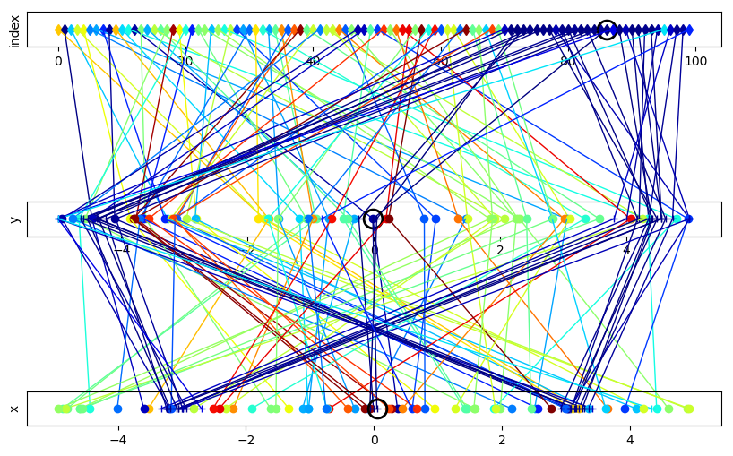

# ParallelHyperparameterSearch

*phs is an ergonomic framework for performing hyperparameter searches on numerous cumpute instances of any arbitrary python function. This is achieved with minimal modifications inside your target function. Possible applications appear in expensive to evaluate numerical computations which strongly depend on hyperparameters such as machine learning.*




## Functionality
+ capable of all kinds of parameter types such as continuous or discrete numerical values, categorical values and even arbitrary python statements
+ no binding to a particular python framework like TensorFlow or PyTorch
+ possible search strategies are explicit specification, random search and Bayesian Optimization
+ no limitation to the number of hyperparameter
+ parameter types and search strategies can be mixed for each parameter set
+ handy monitor and visualization functions for supervising the progress are already built-in
+ capability to continue the calculation in case of system/program failures without losing the results of already completed evaluations

## Structure
The framework consists of the three main modules ```parameter_definition``` (see [Preparation of the Target Function](./docs/preparation_of_the_target_function.md) and [Search Strategies](./docs/search_strategies.md)), ```experiment_definition``` see ([Experiment Definition](./docs/experiment_definition.md)) and ```compute_definition``` (see [Compute Definition](./docs/compute_definition.md)) which represents the semantic separation. This modularity enables the sole creation sole search strategies or experiments without immediate start of the computation. In addition, the decoupled compute definition allows one computation to be stopped and to continue with a different worker pool for example to harness free nodes though upscaling over night.

## Table of Contents
1. [Installation](./docs/installation.md)
2. [Quick Start](./docs/quick_start.md)
3. [Parallelization Technique](./docs/parallelization_technique.md)
4. [Preparation of the Target Function](./docs/preparation_of_the_target_function.md)
5. [Search Strategies](./docs/search_strategies.md)
6. [Data Types, Order and Transfer of Parameters](./docs/data_types_order_transfer.md)
7. [Experiment Definition](./docs/experiment_definition.md)
8. [Compute Definition](./docs/compute_definition.md)
9. [Post Processing](./docs/post_processing.md)
10. [Examples](./examples/README.md)


[1]: http://docs.dask.org/en/latest/index.html "DASK"
[2]: https://en.wikipedia.org/wiki/Griewank_function "Griewank"
[3]: http://www.open-carme.org "Carme"

## Author

Peter Michael Habelitz  
Fraunhofer-Institut für Techno- und Wirtschaftsmathematik ITWM  
Fraunhofer-Platz 1, 67663 Kaiserslautern, Germany  
Tel: +49 631 31600-4942, Fax: +49 631 31600-5942  
<peter.michael.habelitz@itwm.fraunhofer.de>
