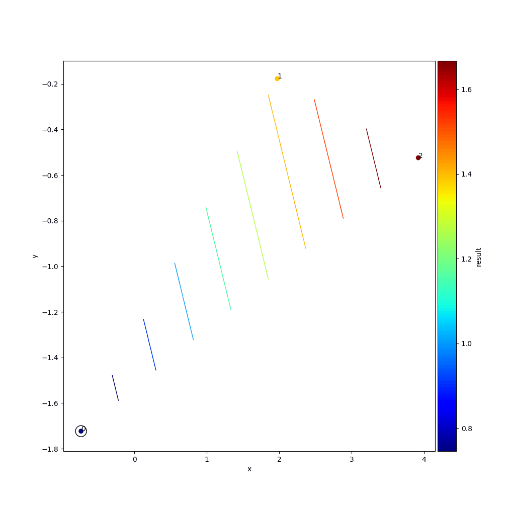
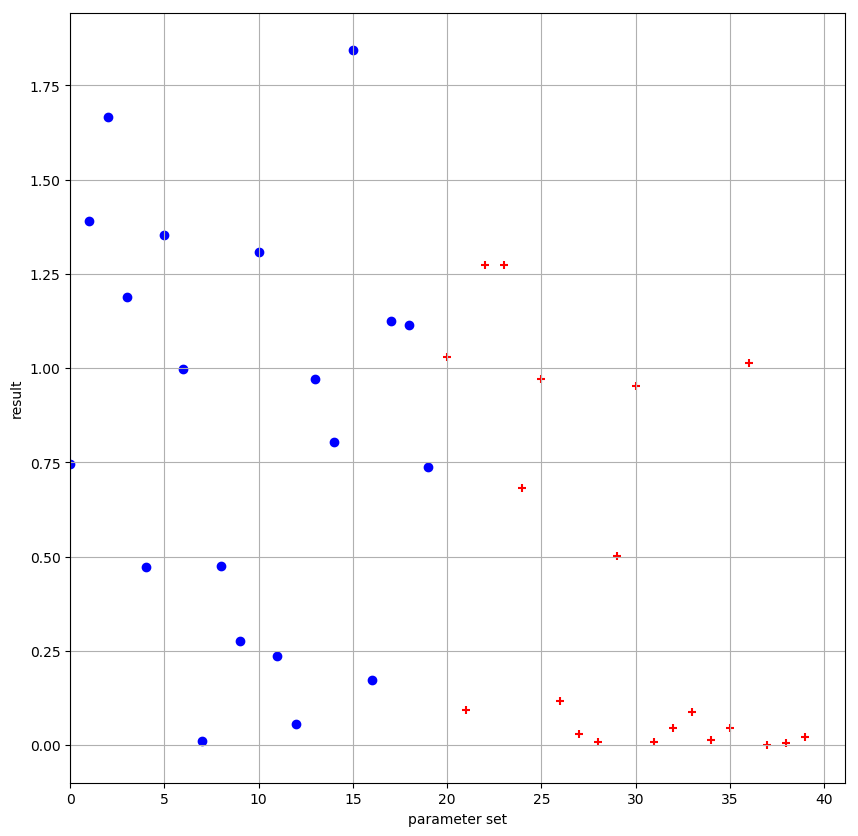
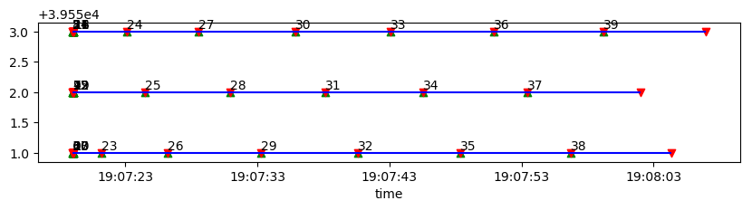
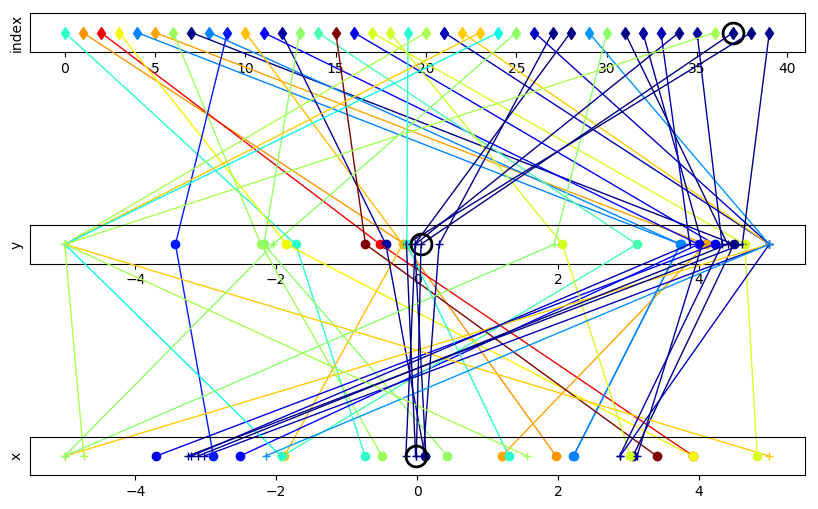

# Post Processing
Another module of this framework provides visualization capabilities for previously performed experiments. The connection to the experiment which should be post processed is done via the experiment folder provided to the class constructor.

```python
import phs.post_processing  # standalone import

post_pro = phs.post_processing.PostProcessing(experiment_dir='/absolute/path/to/an/experiment')
```

## Available Methods
Right now four different methods are available. All generated output will be stored inside the linked experiment folder, where a directory named 'post_processing' is created. Each method expects a parameter ```name``` to give unique file names.

### ```plot_3d```
The ```plot_3d``` method creates a three dimensional plot with individual choice of the dimensions. Therefor ```first```, ```second``` and ```third``` need to get a parameter name used in the linked experiment. Note that ```result``` is valid for addressing the returned value from the target function. The third dimension is color encoded. Interpolated contour lines can be switched on with the flag ```contour```. An animated .gif can be created with the number of samples ```animated_step_size``` added in a single step and ```animated_fps``` frames per second.

```python
post_pro.plot_3d(name='name_of_generated_file',
                 first='parameter_name_of_first_dimension',
                 second='parameter_name_of_second_dimension',
                 third='parameter_name_of_third(color)_dimension',
                 contour=False,
                 animated=False,
                 animated_step_size=1,
                 animated_fps=1)
```

### ```result_evolution```
The result (returned by the target function) is plotted over the indices of the parameter sets.

```python
post_pro.result_evolution(name='name_of_generated_file')
```

### ```create_worker_timeline```
For each machine involved, a timeline is drawn with the parameter sets evaluated by it.

```python
post_pro.create_worker_timeline(name='name_of_generated_file')
```

### ```create_parameter_combination```
For each parameter defined in the experiment, a seperate one dimensional scatter plot is drawn. The points belonging to the same parameter set are connected via lines. These lines show the color coded result.

```python
post_pro.create_parameter_combination(name='name_of_generated_file')
```

## Example

```python
def main():
    import phs.parameter_definition  # standalone import
    import phs.experiment_definition  # standalone import
    import phs.compute_definition  # standalone import
    import phs.post_processing

    pardef = phs.parameter_definition.ParameterDefinition()

    pardef.set_data_types_and_order([('x', float), ('y', float)])

    pardef.add_individual_parameter_set(
        number_of_sets=20,
        set={'x': {'type': 'random', 'bounds': [-5, 5], 'distribution': 'uniform', 'round_digits': 3},
             'y': {'type': 'random', 'bounds': [-5, 5], 'distribution': 'uniform', 'round_digits': 3}},
        prevent_duplicate=True)

    pardef.add_individual_parameter_set(
        number_of_sets=20,
        set={'x': {'type': 'bayesian', 'bounds': [-5, 5]},
             'y': {'type': 'bayesian', 'bounds': [-5, 5]}})

    expdef = phs.experiment_definition.ExperimentDefinition(
        experiment_dir='/absolute/path/to/not/yet/existing/folder/your/experiments/should/be/saved',
        target_module_root_dir='/absolute/path/to/root/dir/in/which/your/test_function/resides',
        target_module_name='file_name_with_test_function_definition_(without_extension)',
        target_function_name='test_griewank',
        parameter_definitions=pardef.get_parameter_definitions())

    compdef = phs.compute_definition.ComputeDefinition(
        experiment_dir='/absolute/path/to/folder/with/existing/experiment',
        parallelization='local_processes',
        local_processes_num_workers=3,
        redirect_stdout=False,
        provide_worker_path=False,
        bayesian_wait_for_all=True)

    compdef.start_execution()

    post_pro = phs.post_processing.PostProcessing(
        experiment_dir='/absolute/path/to/an/experiment')

    post_pro.plot_3d(name='plot_xyr_post',
                     first='x',
                     second='y',
                     third='result',
                     contour=True,
                     animated=True,
                     animated_step_size=1,
                     animated_fps=1)

    post_pro.result_evolution(name='evo_post')
    post_pro.create_worker_timeline(name='worker_timeline_post')
    post_pro.create_parameter_combination(name='parameter_combination_post')


if __name__ == "__main__":
    main()
```

### Generated Images
### ```plot_3d```


### ```result_evolution```


### ```create_worker_timeline```


### ```create_parameter_combination```

