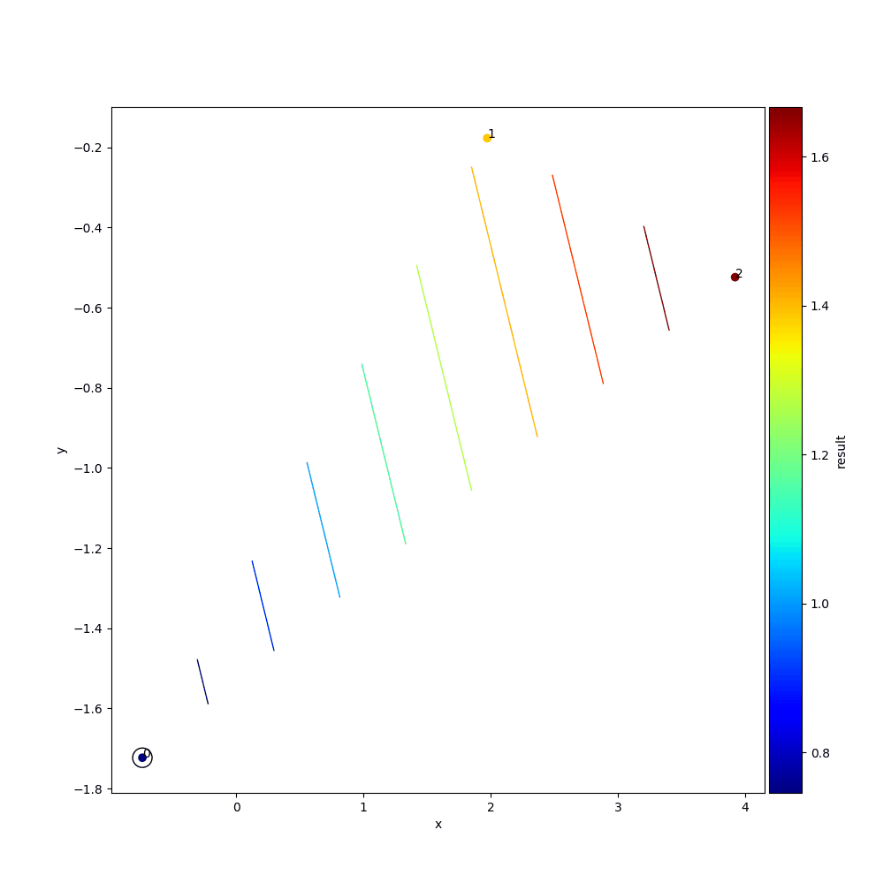

## Quick Start
The easiest way to become familiar with the tool is to go through the following example of finding minima of the second order [Griewank function][2] which is a common test scenario for optimization algorithms. Code with respective output can be found in the examples folder. 

### 1. Prepare your target function

+ declare your phyton script as a function with a single argument named ```parameter```
+ delete (or comment out) all hard coded parameter definitions you want to control with phs tool
+ add ```exec(parameter['hyperpar'],globals(),globals())```
+ return a meaningful parameter

```python
import math as ma

def test_griewank(parameter):
    exec(parameter['hyperpar'],globals(),globals())
    z = (x*x+y*y)/4000 - ma.cos(x)*ma.cos(y/ma.sqrt(2)) + 1
    return z
```
### 2. Define your search strategy

+ the search strategy specifies how the parameters expected by the target function should be generated
+ here 20 initial random sets are generated followed by 10 bayesian optimization sets
+ adapt the parameter export path

```python
import phs.parameter_definition  # standalone import

pardef = phs.parameter_definition.ParameterDefinition()

pardef.set_data_types_and_order([('x', float), ('y', float)])

pardef.add_individual_parameter_set(
    number_of_sets=20,
    set={'x': {'type': 'random', 'bounds': [-5, 5], 'distribution': 'uniform', 'round_digits': 3},
         'y': {'type': 'random_from_list', 'lst': [1.2, 3.4, 5.4, 6.3]}},
    prevent_duplicate=True)

pardef.add_individual_parameter_set(
    number_of_sets=10,
    set={'x': {'type': 'bayesian', 'bounds': [-5, 5], 'round_digits': 3},
         'y': {'type': 'bayesian', 'bounds': [-5, 5], 'round_digits': 3}})

pardef.export_parameter_definitions(export_path='absolute/path/to/parent/folder/for/export')
```

### 3. Setup your experiment
+ create a new script to define a phs experiment (customize the arguments ```experiment_dir```, ```target_module_root_dir```, ```target_module_name```, ```target_function_name``` and ```parameter_definitions_root_dir_in``` of the class instantiation):


```python
import phs.parallel_hyperparameter_search as phs  # standalone import
# Make sure that python can import 'phs'.
# One way is to run the 'install.sh' script provided within this project.

# import CarmeModules.HyperParameterSearch.phs.parallel_hyperparameter_search as phs  # import on Carme


hs = phs.parallel_hyperparameter_search.ParallelHyperparameterSearch(
    **{'experiment_dir': '/absolute/path/to/parent/folder/your/experiments/should/be/saved',
       'experiment_name': 'experiment_griewank_1',
       'target_module_root_dir': '/absolute/path/to/root/dir/in/which/your/test_function/resides',
       'target_module_name': 'file_name_with_test_function_definition_(without_extension)',
       'target_function_name': 'name_of_function_inside_target_module',
       'parameter_definitions_root_dir_in': 'absolute/path/to/parent/folder/for/import',
       'parallelization': 'local_processes'})

hs.start_execution()

```

### 4. Post process the results
+ select the directory of the experiment you want to post process

```python
import phs.post_processing  # standalone import

post_pro = phs.post_processing.PostProcessing(
    experiment_dir='/absolute/path/to/experiment_dir/you/want/to/post_process')

post_pro.plot_3d(name='plot_xyr_post',
                 first='x',
                 second='y',
                 third='result',
                 contour=True,
                 animated=True,
                 animated_step_size=1,
                 animated_fps=1)
```



[2]: https://en.wikipedia.org/wiki/Griewank_function "Griewank"